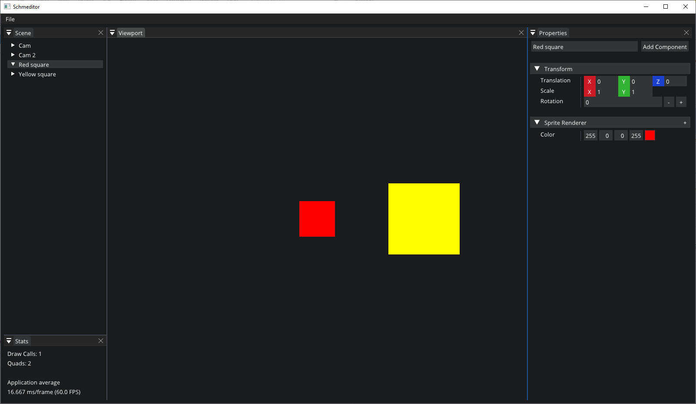

# Schmog

C++ Game Engine for 2D games

## Current features
* Entity-Component-System
* Basic Particle System
* (Very) basic Editor
* Drawing of colorful 2D rectangles! woohoo!
* Cameras
* Inputs

## Special thanks
To the tutorials of "TheCherno" https://www.youtube.com/channel/UCQ-W1KE9EYfdxhL6S4twUNw
